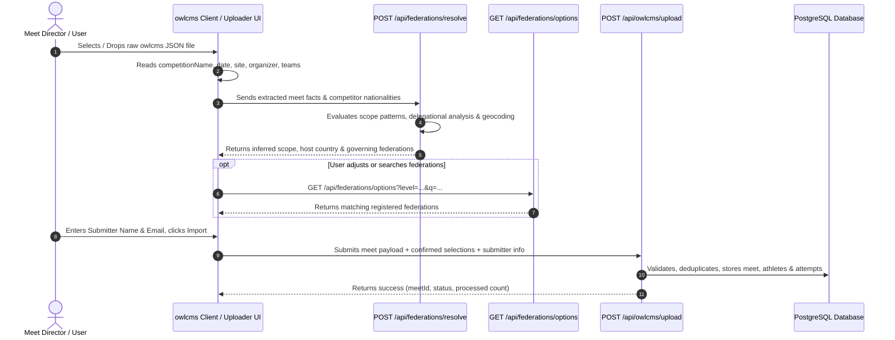

# owlcms Integration Architecture & Developer Guide

This directory contains the technical documentation, API specifications, and frontend integration blueprints for importing competition results from **owlcms** (v1.0 and v2.0 JSON exports) into the weightlifting analytics platform.

---

## 1. System Architecture Overview

The integration follows a decoupled, client-assisted ingestion architecture:

---

## 2. Core Capabilities

### A. Zero-Modification JSON Ingestion
The platform accepts standard, unaltered owlcms JSON export files (v1.0 and v2.0). Meet directors do not need to edit, reformat, or add synthetic properties to their files before uploading.

### B. Autonomous Scope & Federation Resolution
Using competition metadata, venue tokens, and athlete country distributions, the resolver endpoint (`/api/federations/resolve`) automatically determines:
1. **Competition Scope**:
   * `International` (Apex global competitions sanctioned by IWF, UMWF, IMWA, or Olympic Games).
   * `Continental` (Championships under a continental confederation, e.g., PAWF, EWF, AWF, WFA, OWF).
   * `Regional (Multi-Country)` (Cross-border regional championships, e.g., South American, Commonwealth, Nordic, Mediterranean).
   * `National` (Country-wide championships under a national governing federation, e.g., USAW, WCH).
   * `State / Provincial` (Subdivision championships, e.g., FHQ, Ontario, Florida WSO).
   * `Local` (Club invitationals, opens, and developmental meets).
2. **Host Country**: Resolved from direct country tokens, national demonyms, athlete distributions, or venue geocoding.
3. **Governing Federation Tiers**: Automatically mapped to persistent, verified records in the living federation registry.

### C. Attribution & Quality Control
* **Submitter Identity**: All live submissions require a valid **Submitter Name** and **Contact Email**.
* **Dry-Run Testing**: Integrators can test uploads at any time using `dryRun: true` (or the `X-Dry-Run: true` header) to validate data and preview resolution results without writing to the database.
* **Review Queueing**: Meets with ambiguous metadata or unlisted local organizations are safely staged in the Quarantine / Review Queue (`status = 'pending_review'`) for administrative verification before public indexing.

---

## 3. Propagation of System Changes

* **Propagates Automatically (Zero Client Updates Required)**:
  * When new federations, state/provincial associations, or clubs are added to the database registry, they immediately appear in search dropdowns (`/api/federations/options`).
  * When resolver heuristics are refined (e.g., smarter multilingual title recognition or venue matching), the client uploader immediately receives the enhanced inferences without any frontend code changes.
* **Stable Contracts**:
  * The API request and response schemas are strictly version-controlled and backward-compatible.
  * Fields will not be removed or renamed without advance deprecation notices.

---

## 4. Documentation Index

* **[API Reference](file:///C:/Users/PB/Desktop/Bost%20Laboratory%20Services/Weightlifting/weightlifting-frontend/docs/owlcms-integration/API_REFERENCE.md)**: Detailed technical specifications for all three endpoints (`resolve`, `options`, `upload`), including request/response schemas, query parameters, and error codes.
* **[Frontend Integration Blueprint](file:///C:/Users/PB/Desktop/Bost%20Laboratory%20Services/Weightlifting/weightlifting-frontend/docs/owlcms-integration/FRONTEND_INTEGRATION.md)**: Component architecture, UI state flow, and reference code for building or embedding the interactive uploader tool.
